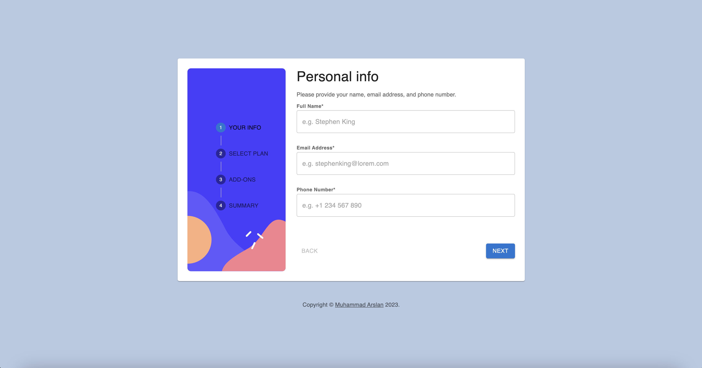

# Multi-Step Form with Next.js, Material-UI, and TypeScript



A multi-step form application built using Next.js, Material-UI, and TypeScript. This project allows users to complete each step of the form, go back to previous steps, view a summary of their selections, and confirm their order. The form is responsive and provides form validation messages for missing fields and incorrect email formats.

## Table of Contents

- [Features](#features)
- [Getting Started](#getting-started)
- [Usage](#usage)
- [Folder Structure](#folder-structure)
- [Technologies Used](#technologies-used)
- [Contributing](#contributing)
- [License](#license)

## Features

- Complete each step of the multi-step form.
- Go back to previous steps to update selections.
- View a summary of selections on the final step and confirm the order.
- Responsive layout for various screen sizes.
- Interactive elements with hover and focus states.
- Form validation messages for missing fields and incorrect email formats.

## Getting Started

To run this project locally, you need to have [Node.js](https://nodejs.org) and [npm](https://www.npmjs.com/) (or [yarn](https://yarnpkg.com/)) installed on your machine.

1. Clone the repository:

```bash
git clone https://github.com/ArslanAkhtar/multi_form_front_end_mentor.git
```

2. Change to the project directory:

```bash
cd multi-step-form
```

3. Install the dependencies:

```bash
npm install
```

or with yarn:

```bash
yarn install
```

## Usage

To run the application in development mode, use the following command:

```bash
npm run dev
```

or with yarn:

```bash
yarn dev
```

This will start the development server, and you can access the application in your web browser at `http://localhost:3000`.

## Folder Structure

The project follows a standard folder structure:

```
multi-step-form/
  ├── components/        # React components used in the application
  ├── lib/               # Custom libraries and utilities
  ├── public/            # Static assets (images, etc.)
  ├── contexts/          # Application context files
  ├── customhooks/       # Custom hooks used in the application
  ├── helpers/           # Helper functions and types
  ├── styles/            # Global styles and theme configuration
  ├── README.md          # Project documentation
  └── package.json       # Package dependencies and scripts
```

## Technologies Used

- [Next.js](https://nextjs.org/) - React framework for server-side rendering and routing.
- [Material-UI](https://mui.com/) - UI component library based on Material Design.
- [TypeScript](https://www.typescriptlang.org/) - Typed superset of JavaScript.
- [Node.js](https://nodejs.org/) - JavaScript runtime for executing server-side code.
- [npm](https://www.npmjs.com/) - Package manager for installing project dependencies.
- [yarn](https://yarnpkg.com/) - Alternative package manager (optional).

## Contributing

Contributions are welcome! If you find a bug or have an improvement idea, please open an issue or submit a pull request.

## License

This project is licensed under the [MIT License](LICENSE). Feel free to use, modify, and distribute the code as you see fit
